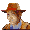

# 🌟 DSi Slot Machine – BOOK OF RO

A fully functional **slot machine** game made for the **Nintendo DS** using MicroLua DS. Spin the reels, trigger bonus rounds, and chase massive wins with expanding bonus symbols and fun animations including sounds.

  
  

---

## 🎮 Gameplay Overview

- 5×3 reel slot machine
- 10 paylines with classic and themed symbols
- Trigger **Bonus Games** by landing **3+ Book symbols**
- During bonus rounds, a **random symbol is chosen to expand vertically** on reels for more winning potential

---

## 🕹 Controls

| Button             | Action                    |
|--------------------|---------------------------|
| `Stylo tap`/`A`    | Spin the reels            |
| `B`                | Toggle Auto Spin mode     |
| `START`            | Exit the game             |

Bonus scenes are triggered and handled automatically and cannot be forced.

---

## 💥 Features

- Smooth reel animations
- Highlighted winning paylines
- Expanding symbols with visual feedback
- Bonus symbol picker with suspense animation
- Retriggerable bonus spins when landing 3+ Books during bonus rounds
- Score tracking for each spin and total session

---

## 🎨 Game Assets Overview

This slot machine game includes a variety of iconic symbols and animated hit effects. Below you'll find a visual reference of all the graphics used for reels and paylines.

### 🧩 Symbol Set

<table align="center">
  <tr>
    <th align="center">Low-Tier</th>
    <th align="center">High-Tier</th>
  </tr>
  <tr>
    <td align="center">
       
      Ten 
      3x: 5 | 4x: 25 | 5x: 100
    </td>
    <td align="center">
       
      Scarab 
      2x: 5 | 3x: 30 | 4x: 100 | 5x: 750
    </td>
  </tr>
  <tr>
    <td align="center">
       
      J 
      3x: 5 | 4x: 25 | 5x: 100
    </td>
    <td align="center">
       
      Sungod 
      2x: 5 | 3x: 30 | 4x: 100 | 5x: 750
    </td>
  </tr>
  <tr>
    <td align="center">
       
      Q 
      3x: 5 | 4x: 25 | 5x: 100
    </td>
    <td align="center">
       
      Explorer 
      2x: 10 | 3x: 100 | 4x: 1000 | 5x: 5000
    </td>
  </tr>
  <tr>
    <td align="center">
       
      K 
      3x: 5 | 4x: 40 | 5x: 150
    </td>
    <td align="center" rowspan="2">
       
      Book (Bonus & Wild) 
      2x: 0 | 3x: 20 | 4x: 200 | 5x: 250
    </td>
  </tr>
  <tr>
    <td align="center">
       
      A 
      3x: 5 | 4x: 40 | 5x: 150
    </td>
  </tr>
</table>

### 💥 Hit Effect Animations
Each payline that was hit is marked with a unique overlay from 1 to 10. Only the symbols that actually score will be hightlighted like this.

 
 
 
 
 
 
 
 
 
 
 

---

## 🎮 Usage

This game is built using [MicroLua DS](https://sourceforge.net/projects/microlua/), a lightweight Lua framework for the Nintendo DS.

### 📦 Requirements

- A Nintendo DS or DS emulator (e.g., DeSmuME)
- A flashcard or emulator setup that supports `.nds` homebrew
- [MicroLua DS](https://sourceforge.net/projects/microlua/)

### 🚀 Running the Game

1. Clone or download this repository to your computer.
2. Copy the game folder to your flashcart or launch it through your emulator with MicroLua DS.
3. **Literally profit**

---

## ⚠️ Disclaimer

This project is a **joke game** made for fun and experimentation — don't take it too seriously! 🎰🧪

While the gameplay mechanics are inspired by slot machines and there's effort put into polish, you might still encounter **bugs or janky behavior** here and there. It's a **work in progress**, and development is ongoing. 🐛🚧

Thanks for understanding, and feel free to report any issues — or even better, contribute fixes!
